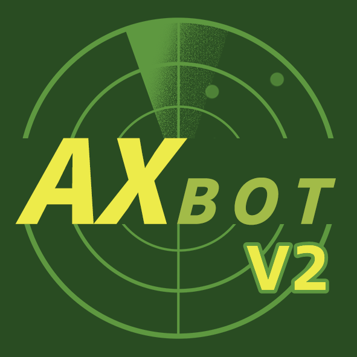

    

# AXBot 艾克斯机器人

     

> **V2已经正式发布！V2版本不向下兼容。开发者不再对V1版本进行支持**

## 简介

AXBot，全称艾克斯机器人（以下简称 "AXBot"），是一个在Kook、QQ频道等社交平台上可用的机器人。她不仅具备丰富的交互功能，还专注于为游戏爱好者提供各种游戏相关的服务。作为一款功能强大的游戏类问答机器人，AXBot的终极目标是协助玩家获取游戏数据、分析游戏数据，智能回答游戏攻略，并实现社交平台与游戏的无缝连接。

> 艾克斯机器人的中文名是基于音译而来的，而 "AX" 则是作者平时使用的昵称，并没有特殊的含义。

AXBot目前具备以下功能和能力：

- 可以在KOOK和QQ频道上运行
- ~~能够查询《战争雷霆》的战绩信息~~ （v2因crawler故障，无法获取，故暂不支持）
- 能够查询《绝地求生》的生涯数据
- 当B站直播间开播时提醒特定人群

同时，AXBot还具备以下一些有趣的小功能：

- 每日电子算命，获取当天的气运值
- 和ChatGPT聊天

AXBot的设计思路源自于https://github.com/axiangcoding/antonstar-bot ，这是开发者在聊天机器人领域的首次尝试。由于各种原因，asbot已经完成了其生命周期，而AXBot则是对asbot的延续和扩展。目前，AXBot已经完全迁移并运行。

走过路过，点个`⭐`吧

## 文档
AXBot V2的文档已经迁移到 https://axbot-dev.github.io/axbot-doc/，并以此为准。请移步查看

## 开源协议

本仓库遵循 [GPL 3.0](LICENSE) 协议。

## 赞助

机器人的开发过程耗费了大量时间和精力，而其部署需要消耗大量服务器资源，此外，日常的维护也需要不断投入资金。这意味着开发、部署和维护AXBot都具有一定的成本。因此，为了提供服务，AXBot不得不向所有用户提供免费但有限的功能。然而，如果您愿意赞助AXBot或订阅我们的服务，您将能够享受更高的使用限制和额外的功能。关于付费方面的更多信息，请查看以下链接：

爱发电：[点击赞助](https://afdian.net/order/create?user_id=966767508b5811eca47c52540025c377&custom_price=10)
