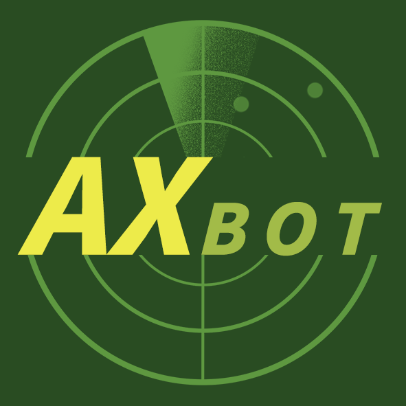

    

# AXBot 艾克斯机器人

     

## 简介

AXBot，全称艾克斯机器人（以下简称 "AXBot"），是一个能够在Kook、QQ上使用的机器人。它可以查询游戏战绩，并具备一些有趣的交互功能。AXBot的终极目标是成为一个功能丰富的游戏型机器人，能够协助玩家获取、分析游戏数据，方便地查询游戏数据等。

AXBot目前支持：

1. 接入Kook机器人或者Cqhttp
2. 每日电子算命
3. 战争雷霆战绩查询
4. B站直播提醒

AXBot的设计思路来源于 [https://github.com/axiangcoding/antonstar-bot](https://github.com/axiangcoding/antonstar-bot)，asbot的功能将陆续迁移到AXBot中。

> 艾克斯机器人的中文名是音译而来的，而 "AX" 则是作者平时所使用的昵称。

## 使用手册
如果您是一位普通用户，对于AXBot的使用方式和所具备的功能感到好奇，我们为您提供了使用手册的链接，其中详尽列出了该机器人现已具备的全部功能及正在开发中的新功能。请随时点击以下文档链接查看。

[使用手册](docs/user_guide.md)

你可以通过以下方式将官方维护的AXBot机器人邀请到您的群组或者服务器中：

- Kook: [内测阶段，暂不开放]
- QQ: [内测阶段，暂不开放]

除了官方维护的机器人外，还有一些社区维护的机器人：

- [实际上还没有]

## 部署指南

如果您希望自己部署和维护机器人，且愿意承担服务器费用和相关维护工作，请点击下方的文档链接，详细阅读相关内容。

[部署指南](docs/deploy_guide.md)

需要注意的是，AXBot机器人目前正在快速迭代开发中。如果您部署了AXBot机器人，我们强烈建议您更新到最新版本以获取最完整的功能和最新的错误修复。但同时，我们也建议在更新之前，详细阅读更新日志并解决可能存在的兼容问题。如果您在更新过程中遇到任何问题，欢迎提出ISSUE获取帮助。

## 开发指南

如果您有意开发AXBot，我们建议您点击下方的文档链接，详细了解机器人的设计思路和一些有用的开发信息。

[开发指南](docs/develop_guide.md)

在早期版本的开发过程中，开发者可能会因为各种原因对代码进行结构性调整，请务必确保您是基于最新的代码进行开发的，避免出现大范围的冲突。

## 开源协议

本仓库遵循 [MIT license](LICENSE) 协议。

## 赞助

机器人的部署本身需要消耗服务器资源，日常的维护也需要投入资金，这意味着部署和维护AXBot具有一定的成本。因此AXBot将向所有用户提供免费但有限的服务。如果您愿意赞助AXBot或者订阅服务，您将能够享受更高的使用限制和额外的功能。更多关于付费的内容，您可以查看下面的链接。除了下文提供的渠道外，开发者不会接受其他任何渠道的捐助

爱发电：https://afdian.net/a/axbot 
